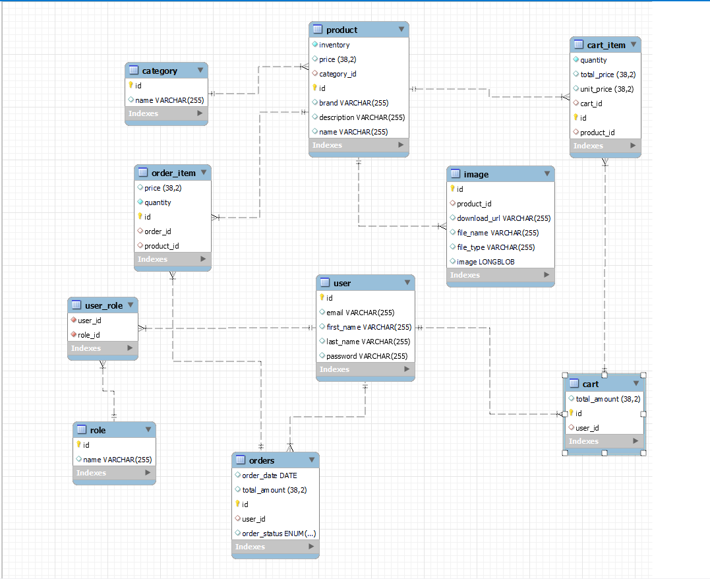

# 🛒 Dream Shops E-commerce Demo

Welcome to **Dream Shops**, an e-commerce demo project built to showcase the structure and functionality of a robust online shopping platform using **Java Spring Boot**. 
This project is designed to provide clear insights into various architectural layers and endpoints for easy navigation and development.

## 📋 Project Overview

Dream Shops is a demo project simulating a full-fledged e-commerce application. 
It is built with a layered architecture that includes controllers, services, repositories, and data transfer objects (DTOs) for a clean separation of concerns.

### Project Structure




The project follows a typical **Spring Boot** structure, organized for clarity and maintainability:

- **Configuration**: Configuration files for app settings.
- **Controllers**: Handles HTTP requests and directs them to the appropriate service layers.
- **DTOs**: Data transfer objects to transfer data between the client and server.
- **Models**: Defines entities for database mapping.
- **Repositories**: Interfaces for database interactions.
- **Services**: Business logic handling.
- **Enums & Exceptions**: Custom enums and exception handling.

### Tech Stack

- **Java**: Main programming language.
- **Spring Boot**: Framework for building the RESTful APIs.
- **MySQL**: Database for data persistence.
- **Hibernate**: ORM for database interaction.
- **Maven**: Dependency management.

### Project Configuration

The project settings are defined in `application.properties`:

```properties
spring.application.name=dream-shops
server.port=8088
spring.datasource.url=jdbc:mysql://localhost:3306/dream_shop_db
spring.datasource.username=root
spring.datasource.password=123123
spring.datasource.driver-class-name=com.mysql.cj.jdbc.Driver
spring.jpa.properties.hibernate.dialect=org.hibernate.dialect.MySQLDialect
spring.jpa.show-sql=true
spring.jpa.properties.hibernate.format_sql=true
spring.jpa.hibernate.ddl-auto=update
spring.servlet.multipart.max-file-size=5MB
spring.servlet.multipart.max-request-size=5MB

## 🚀 API Endpoints

### User Controller

- `PUT /api/v1/users/{userId}/update` - Update user details.
- `POST /api/v1/users/add` - Add a new user.
- `GET /api/v1/users/{userId}/user` - Retrieve user details.
- `DELETE /api/v1/users/{userId}/delete` - Delete a user.

### Product Controller

- `PUT /api/v1/products/product/{id}/update` - Update product details.
- `POST /api/v1/products/add` - Add a new product.
- `GET /api/v1/products/{productId}/product` - Get product details by ID.
- `GET /api/v1/products/products/{name}/products` - Get products by name.
- `GET /api/v1/products/products/by/category-and-brand` - Filter products by category and brand.
- `GET /api/v1/products/products/by-brand` - List products by brand.
- `GET /api/v1/products/product/{category}/all/products` - Get all products in a category.
- `GET /api/v1/products/product/count/by-brand/and-name` - Count products by brand and name.
- `GET /api/v1/products/by/brand-and-name` - Get products by brand and name.
- `GET /api/v1/products/all` - List all products.
- `DELETE /api/v1/products/product/{productId}/delete` - Delete a product by ID.

### Image Controller

- `PUT /api/v1/images/image/{imageId}/update` - Update an image.
- `POST /api/v1/images/upload` - Upload a new image.
- `GET /api/v1/images/image/download/{imageId}` - Download an image.
- `DELETE /api/v1/images/image/{imageId}/delete` - Delete an image.

### Category Controller

- `PUT /api/v1/categories/category/{categoryId}/update` - Update category details.
- `POST /api/v1/categories/add` - Add a new category.
- `GET /api/v1/categories/category{categoryName}/category` - Get category by name.
- `GET /api/v1/categories/category/{categoryId}/category` - Get category by ID.
- `GET /api/v1/categories/all` - List all categories.
- `DELETE /api/v1/categories/category/{categoryId}/delete` - Delete a category by ID.

### Cart Item Controller

- `PUT /api/v1/cartItems/cart/{cartId}/item/{itemId}/updateQuantity` - Update cart item quantity.
- `POST /api/v1/cartItems/item/add` - Add a new cart item.
- `DELETE /api/v1/cartItems/cart/{cartId}/item/{itemId}/remove` - Remove an item from the cart.

### Order Controller

- `POST /api/v1/orders/order` - Place a new order.
- `GET /api/v1/orders/{userId}/orders` - Retrieve all orders for a user.
- `GET /api/v1/orders/{orderId}/order` - Get order details by ID.

### Cart Controller

- `GET /api/v1/carts/{cartId}/my-cart` - View cart details.
- `GET /api/v1/carts/{cartId}/cart/total-price` - Get total price of items in the cart.
- `DELETE /api/v1/carts/{cartId}/clear` - Clear the cart.

## 🗂️ Folder Structure

### Major Directories

- **`config`**: Application configuration.
- **`controller`**: REST controllers handling HTTP requests.
- **`dto`**: Data transfer objects.
- **`model`**: Entity classes.
- **`repository`**: Interfaces for data persistence.
- **`service`**: Business logic implementations.

## 🛠️ How to Run

1. **Clone the repository**:
   ```bash
   git clone https://github.com/btbatux/dream-shops.git

#### 🚀 API Endpoints

### User Controller

- `PUT /api/v1/users/{userId}/update` - Update user details.
- `POST /api/v1/users/add` - Add a new user.
- `GET /api/v1/users/{userId}/user` - Retrieve user details.
- `DELETE /api/v1/users/{userId}/delete` - Delete a user.

### Product Controller

- `PUT /api/v1/products/product/{id}/update` - Update product details.
- `POST /api/v1/products/add` - Add a new product.
- `GET /api/v1/products/{productId}/product` - Get product details by ID.
- `GET /api/v1/products/products/{name}/products` - Get products by name.
- `GET /api/v1/products/products/by/category-and-brand` - Filter products by category and brand.
- `GET /api/v1/products/products/by-brand` - List products by brand.
- `GET /api/v1/products/product/{category}/all/products` - Get all products in a category.
- `GET /api/v1/products/product/count/by-brand/and-name` - Count products by brand and name.
- `GET /api/v1/products/by/brand-and-name` - Get products by brand and name.
- `GET /api/v1/products/all` - List all products.
- `DELETE /api/v1/products/product/{productId}/delete` - Delete a product by ID.

### Image Controller

- `PUT /api/v1/images/image/{imageId}/update` - Update an image.
- `POST /api/v1/images/upload` - Upload a new image.
- `GET /api/v1/images/image/download/{imageId}` - Download an image.
- `DELETE /api/v1/images/image/{imageId}/delete` - Delete an image.

### Category Controller

- `PUT /api/v1/categories/category/{categoryId}/update` - Update category details.
- `POST /api/v1/categories/add` - Add a new category.
- `GET /api/v1/categories/category{categoryName}/category` - Get category by name.
- `GET /api/v1/categories/category/{categoryId}/category` - Get category by ID.
- `GET /api/v1/categories/all` - List all categories.
- `DELETE /api/v1/categories/category/{categoryId}/delete` - Delete a category by ID.

### Cart Item Controller

- `PUT /api/v1/cartItems/cart/{cartId}/item/{itemId}/updateQuantity` - Update cart item quantity.
- `POST /api/v1/cartItems/item/add` - Add a new cart item.
- `DELETE /api/v1/cartItems/cart/{cartId}/item/{itemId}/remove` - Remove an item from the cart.

### Order Controller

- `POST /api/v1/orders/order` - Place a new order.
- `GET /api/v1/orders/{userId}/orders` - Retrieve all orders for a user.
- `GET /api/v1/orders/{orderId}/order` - Get order details by ID.

### Cart Controller

- `GET /api/v1/carts/{cartId}/my-cart` - View cart details.
- `GET /api/v1/carts/{cartId}/cart/total-price` - Get total price of items in the cart.
- `DELETE /api/v1/carts/{cartId}/clear` - Clear the cart.

## 🗂️ Folder Structure

### Major Directories

- **`config`**: Application configuration.
- **`controller`**: REST controllers handling HTTP requests.
- **`dto`**: Data transfer objects.
- **`model`**: Entity classes.
- **`repository`**: Interfaces for data persistence.
- **`service`**: Business logic implementations.

## 🛠️ How to Run

1. **Clone the repository**:
   ```bash
   git clone https://github.com/yourusername/dream-shops.git

## Navigate to the project directory:
- `cd dream-shops

## Run the application:
- `mvn spring-boot:run

## 📖 Additional Information
- **Port: The application runs on port 8088 by default.
- **Database: Ensure MySQL is running locally, and a database named dream_shop_db is created.
- **Dependencies: Managed through pom.xml, including libraries for Spring Boot, Hibernate, and MySQL.

## ✨ Features
- **CRUD operations for users, products, categories, images, cart items, and orders.
- **Structured and modular architecture.
- **Comprehensive endpoint documentation for easy access.

## 🤝 Contributions
- **Contributions are welcome! Feel free to open issues or submit pull requests for improvements.
